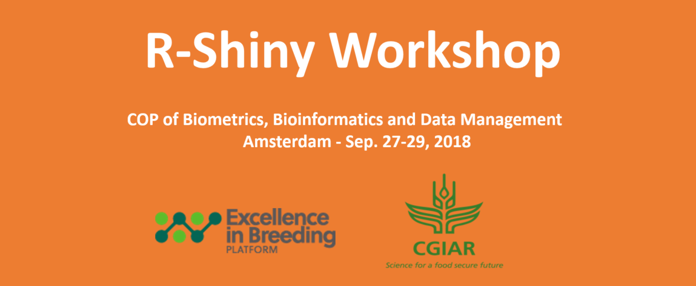

# Shiny Workshop the Excellence in Breeding Platform

# 

## Introduction

Repository of the `Shiny Workshop` material for the CoP  `Bioinformatics, Biometrics and Data Management` (Module 5)(http://excellenceinbreeding.org/module5).

## Location and Dates

- Location: The workshop is held in Amsterdam from Septemeber 24-29th.
- Date: from 24-29th.

## Organization

This workshop is organized by the `Excellence in Breeding Platform (EiB)` (http://excellenceinbreeding.org/), specifically, the  `Bioinformatics, Biometrics and Data Management` (module 5). All the coordinations is thanks to Dr. Abhishek Rathore [a.rathore@cgiar.org] from `ICRISAT`. 

## Training

Omar Benites Alfaro [o.benites@cgiar.org], [obacc07@gmail.com] and Ivan Perez Masias [i.perez@cgiar.org], [ivanpe834@gmail.com] work at the `International Potato Center (CIP)`, in the `Research Informatic Unit (RIU)`. From 2014 they have been working with Shiny applications in development and production contexts. 

This trainings follow the next guidelines:  

- Introducction to R and Shiny
- Inputs and Outpus in Shiny
- RenderUI and Reactivity
* Case 1: Interactive statistical plots for breedings programs

- Connect to databases
- ShinyDashboard
- Actions Buttons and ObserveEvents
* Case 2: Management of germplasm, Design of experiments (stas. designs) and Statistical analysis for breeding trials.

- Customizing applications
- Shiny Layout principles
- CSS for Shiny Apps.
- Publications of shiny apps: shiny.io and ShinyServer.
* Case 3: Put shiny on the Web!

# Case studies using Shiny

- HIDAP: stand-alone version (offline) used for potato and sweetpotato programs https://research.cip.cgiar.org/gtdms/hidap/

- HIDAP-SweetPotatoBase: ShinyApp using the Breeding API to communicate plaforms. https://apps.cipotato.org/hidap_sbase/

- HIDAP AGROFIMS: The Agronomy Field Information Management System (AgroFIMS) https://apps.cipotato.org/hidapagrofims

